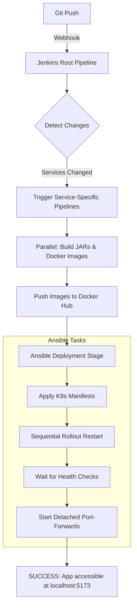

# WeCode - System Architecture & Flow Guide

This document explains exactly how the WeCode system works, from the moment you push code to how Google OAuth functions across the "bridge" between your computer and the Kubernetes cluster.

---

## 1. Network Bridging (The "Localhost" Magic)

The biggest point of confusion is how `localhost` works when the application is inside a **Minikube** cluster.

### The Problem
*   **Minikube** runs inside a virtual machine or container. It has its own private IP (e.g., `192.168.49.2`).
*   **Google OAuth** requires a secure, reachable URL. It cannot see "private IPs" inside your computer.
*   **You (the user)** want to access the site at `localhost` for a smooth development experience.

### The Solution: `kubectl port-forward`
Port forwarding acts as a **tunnel**. When the pipeline runs the `port-forward.sh` script:
1.  It opens a "listener" on your computer (Host) at a specific port (e.g., 5173).
2.  Any request sent to `http://localhost:5173` is "sucked" into the tunnel.
3.  The tunnel carries the request **inside** the Minikube cluster directly to the **Frontend Pod**.
4.  This is why we use `localhost` in all our configurations: it makes the complex Kubernetes network invisible to the browser and Google.

---

## 2. The Deployment Flow (Pipeline Trigger)

When you push code to GitHub, the following chain reaction happens:

1.  **Detect Changes:** Jenkins compares the current commit with the previous one. It only rebuilds services that have modified files.
2.  **Parallel Build:** Services like `auth-service` and `submission-service` build their JAR files and Docker images at the same time to save time.
3.  **Ansible Deploy:** Ansible copies your `.yml` files to the server and applies them. It then restarts each deployment one-by-one to ensure zero downtime.
4.  **Automatic Port-Forwarding:** This is the final step. Ansible triggers `port-forward.sh`, which opens the tunnels and "disowns" them so they stay open after Jenkins finishes.

---

## 3. The Google OAuth Flow (Step-by-Step)

This is how the application logs you in using Google while running in K8s:

1.  **User Action:** You click "Login" on `http://localhost:5173`.
2.  **Initial Redirect:** The Frontend sends you to `http://localhost:8085/auth/google`.
    *   *Tunnel:* Your computer sends this to the **Auth Service Pod**.
3.  **Google Redirect:** The Auth Service Pod calculates the Google URL and tells your browser to go to Google's login page.
4.  **Email Selection:** You choose your account on Google's site.
5.  **The Callback (The Critical Step):** Google redirects your browser back to:
    `http://localhost:8085/auth/google/callback?code=...`
    *   *Tunnel:* Because our **port-forward** is running, your browser finds `localhost:8085` and sends the Google code back into the cluster to the Auth Pod.
6.  **Token Exchange:** The Auth Pod talks to Google (internally) to verify you, saves you in the MySQL database, and generates a **JWT Token**.
7.  **Final Bounce:** The Auth Pod tells your browser to go to:
    `http://localhost:5173/login/callback?token=XYZ`
    *   *Tunnel:* Your browser follows this back to the **Frontend Pod**.
8.  **Login Complete:** The React app reads the token from the URL, saves it in `sessionStorage`, and you are now logged in!

---

## 4. Summary of Port Mappings

| Service | Host Port (Your PC) | Cluster Port (Pod) | Use Case |
| :--- | :--- | :--- | :--- |
| **Frontend** | 5173 | 80 | Viewing the website |
| **API Gateway** | 8090 | 8090 | Main API entry point |
| **Auth Service** | 8085 | 8085 | Google OAuth Login |
| **RabbitMQ** | 15672 | 15672 | Monitoring the task queue |
| **Kibana** | 5601 | 5601 | Viewing logs |

---

## 5. Why the Pipeline sometimes fails?
*   **Missing Secrets:** If `wecode-auth-secret` is not manually applied, the Auth Pods can't start (`CreateContainerConfigError`).
*   **Memory:** Java services need time to "warm up." If Minikube is slow, the health checks might timeout.
*   **Port Conflicts:** If you are already running a manual port-forward, the Jenkins user might fail to "steal" the port. Always run `./port-forward.sh stop` before starting a big pipeline run.
